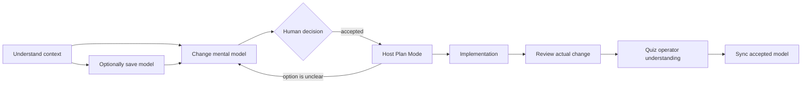

# mental

`mental` is an agent-native plugin for building, explaining, testing, and maintaining verifiable mental models. It helps people understand repositories and source-bound learning material from inside Claude Code or Codex.

It is not a standalone CLI, hosted service, or replacement for source material. The interface is nine skills. The bundled Python scripts are private implementation helpers used by those skills.

[繁體中文指南](README.zh-TW.md)

Design notes: [background and research framing](docs/design-background.md) · [STE100 evaluation and writing policy](docs/ste100-evaluation.md)

## Quickstart

### 1. Load `mental`

The fastest Claude Code development setup is:

```sh
git clone https://github.com/issac1441/mental.git
cd /path/to/the-repository-you-want-to-understand
claude --plugin-dir /absolute/path/to/mental
```

For Codex, install `mental` from a configured plugin marketplace as described in [Install and validate](#install-and-validate), then open the target repository:

```sh
codex -C /path/to/the-repository-you-want-to-understand
```

### 2. Ask immediately

```text
/mental:understand How does a request move through this repository?
$mental:understand How does a request move through this repository?
```

`understand` works directly from the current repository or supplied sources. It is read-only and does not require a `mental/` workspace.

It infers the current Job and Lens from the request and relevant session history. You can override them:

```text
/mental:understand Explain the retry decision. job=decide lens=pm
```

Built-in Jobs are `orient`, `decide`, `predict`, `verify`, and `repair`. Built-in Lenses are `general`, `engineer`, `architect`, `pm`, `operator`, `student`, and `researcher`; projects may add shared Lens artifacts under `mental/lenses/`. Most users do not need to set either control.

For advanced steering, `views=anchor,map,mechanism,scenario,evidence` selects semantic slices. Response density follows natural language such as “briefly” or “go deep.” Each skill's Input contract is canonical; argument autocomplete is not guaranteed across hosts.

### 3. Optionally save a reusable model

```text
/mental:build Save the reusable request-routing model from this repository.
$mental:build Save the reusable request-routing model from this repository.
```

`build` is optional. Use it when the model should survive the current conversation. Mechanical artifacts can be refreshed from registered evidence. Conceptual artifacts remain drafts until their verification basis and checked predictions support activation. Human decisions remain separate records.

### 4. Decide and review a change

```text
/mental:change Add request timeouts without changing failure semantics.
/mental:change Tell me the actual effect of option A in the current plan.
/mental:review Review the current diff against the accepted model.
/mental:quiz current-change items=12 feedback=end format=mixed
```

Use the `$mental:*` form in Codex. `change` is conversational and read-only unless asked to record a draft brief. It stops for a human decision. `review` first explains what actually changed, then audits it.

### 5. Learn from supplied material

```text
/mental:learn Use docs/protocol.md to teach me how to explain and debug this protocol.
/mental:practice Help me repair my weakest relationship in this model.
/mental:quiz docs/protocol.md items=12 format=open
```

`learn` can teach directly from supplied material; `build` is not required first. Personal goals, answers, progress, and session records are written only after response evidence and explicit consent for the active session. They stay in gitignored `.mental/`.

## Skills

| Skill | Purpose | Writes by default |
| --- | --- | --- |
| `understand` | Explain immediately with an inferred or selected Job and Lens | No |
| `build` | Save reusable mechanical, conceptual, decision, Lens, or conflict artifacts | Shared artifacts only |
| `sync` | Refresh reproducible mechanics and record unresolved model deltas | Mechanical refresh or draft delta |
| `doctor` | Audit structure, lenses, evidence, drift, and privacy | No |
| `change` | Explain intent, options, a plan, or TODOs before implementation | No; draft brief only when asked |
| `review` | Explain the actual change, then audit it against the agreed model | No |
| `learn` | Diagnose 2–5 high-information gaps, then teach adaptively | Private state only after evidence and consent |
| `practice` | Adapt one task at a time to repair a weak relationship | Private state only after evidence and consent |
| `quiz` | Deliver a complete 10–20 item bounded assessment | Private results only with consent |

### Practice versus quiz

Use `practice` when the next prompt should depend on the last answer: task → first broken relationship → minimal correction → structurally equivalent scenario → transfer → boundary. Use `quiz` when you want a complete exam. Quiz defaults to 12 mixed items and feedback at the end; an objective result such as `9/12` is allowed, but it never becomes a fake mastery percentage or global ability label.

## When to invoke each skill

| Situation | Skill |
| --- | --- |
| You entered an unfamiliar repository | `understand` |
| The current explanation or session became confusing | `understand` |
| A plan presents option A versus B | `change` |
| A long TODO list hides decisions or effects | `change` |
| The agent finished implementing a diff | `review` |
| You want to verify that you understand the change | `quiz current-change` |
| You are starting a new source-bound topic | `learn` |
| A useful explanation should persist across sessions | `build` |
| One concept or relationship remains weak | `practice` |
| Sources or code drifted from the active model or accepted decision | `sync` |
| Artifacts, custom lenses, or privacy boundaries may be invalid | `doctor` |

## Representative journeys

**Vibe coding:** `understand → optional build → change → human decision → Plan Mode → implementation → review → quiz → sync`

**Product decision:** `understand lens=pm → change compare A/B → human decision → Plan Mode → review`

**Learning:** `learn from supplied sources → practice → quiz → optional build for reusable material`



`change` usually comes before Plan Mode: it defines what should change and exposes tradeoffs. Plan Mode then defines how to implement the accepted decision. When a plan or TODO already exists, `change` can interpret it; return to Plan Mode after the decision changes.

## Artifact layout

```text
mental/
├── index.md
├── sources.md
├── glossary.md
├── lenses/          # reusable role lenses, on demand
├── model/map.md
├── concepts/
├── scenarios/
├── contracts/       # repository mode, on demand
├── decisions/       # append-preserving human decisions
├── conflicts/       # open or resolved evidence/model conflicts
├── changes/         # recorded deltas, on demand
├── learning/path.md # learning mode, on demand
├── misconceptions/
└── exercises/

.mental/
├── .gitignore
├── profile.md
├── mastery.json
└── sessions/
```

Every shared Markdown artifact has stable English frontmatter keys and IDs. Mechanical artifacts use `current` or `stale`; conceptual artifacts use `draft`, `active`, or `stale`; decisions use `pending`, `accepted`, `rejected`, or `superseded`. See [the artifact contract](references/artifact-contract.md).

## Install and validate

### Claude Code

```sh
claude --plugin-dir /absolute/path/to/mental
claude plugin validate /absolute/path/to/mental
```

The repository is also its own Claude Code marketplace (`.claude-plugin/marketplace.json`), so a persistent install needs no separate marketplace repo:

```sh
claude plugin marketplace add issac1441/mental
claude plugin install mental@mental
```

A local checkout works the same way: `claude plugin marketplace add /absolute/path/to/mental`.

### Codex

Install `mental` from a configured plugin marketplace, then use `/skills` or type `$` to select a skill. This repository ships its own marketplace manifest, so the checkout can be registered directly:

```sh
codex plugin marketplace add /absolute/path/to/mental
codex plugin add mental@mental
```

The package uses `.codex-plugin/plugin.json` plus `skills/*/SKILL.md`. Claude and Codex share the same skill semantics.

### OpenCode compatibility

OpenCode support is documentation-only in v1 and does not promise native namespace parity. Copy or link `skills/`, `references/`, `scripts/`, and `assets/` under one `.agents/` directory so the support paths remain intact. Skills appear by unscoped names such as `understand` and `build`.

## Development

The repository has no runtime dependencies:

```sh
python3 -m unittest discover -s tests -v
python3 scripts/scaffold_workspace.py /tmp/mental-demo --mode hybrid --language en
python3 scripts/ensure_private_state.py /tmp/mental-demo --language en
python3 scripts/validate_workspace.py /tmp/mental-demo
```

The helper scripts are internal skill implementation details, not a supported end-user CLI.

Explanation quality is measured by the learning-transfer eval in [`evals/`](evals/README.md): a no-code-access reader answers probe questions using only the skill's explanation, and the result is compared against a bare-model baseline.

## License

[0BSD](LICENSE). Use, copy, modify, and distribute it freely. Redistribution does not require attribution or preservation of a copyright notice.
