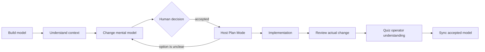

# mental

`mental` is an agent-native plugin for building, explaining, testing, and maintaining verifiable mental models. It helps people understand repositories and source-bound learning material from inside Claude Code or Codex.

It is not a standalone CLI, hosted service, or replacement for source material. It has no backend, account, telemetry, MCP server, or external LLM API. The interface is nine skills. The bundled Python scripts are private implementation helpers used by those skills.

[繁體中文指南](README.zh-TW.md)

Design notes: [background and research framing](docs/design-background.md) · [STE100 evaluation and writing policy](docs/ste100-evaluation.md)

## Quickstart

### 1. Load `mental`

The fastest Claude Code development setup is:

```sh
git clone https://github.com/issac1441/mental.git /absolute/path/to/mental
cd /path/to/the-repository-you-want-to-understand
claude --plugin-dir /absolute/path/to/mental
```

For Codex, install `mental` from a configured plugin marketplace as described in [Install and validate](#install-and-validate), then open the target repository:

```sh
codex -C /path/to/the-repository-you-want-to-understand
```

### 2. Build a draft model

```text
/mental:build Build a repository mental model for the current workspace.
$mental:build Build a repository mental model for the current workspace.
```

`build` creates draft artifacts and shows a promotion gate. Review the boundaries, relationships, inferences, success and failure scenarios, conflicts, and known gaps. Promote only the artifacts you accept.

### 3. Ask with automatic or manual context

```text
/mental:understand How does a request move through this repository?
/mental:understand Explain the retry decision. lens=pm views=anchor,scenario detail=brief
```

`understand` first uses explicit controls, then the current goal, session history, private learning state, exposed host memory as a weak signal, and scope defaults. It reports the selected Lens, Views, Detail, and selection basis. It never saves inferred preferences unless asked.

Available controls:

- `lens=general|engineer|architect|pm|operator|student|researcher|<custom-lens-id>`
- `views=anchor,map,mechanism,scenario,evidence` as a multi-selection
- `detail=brief|standard|deep`

When no stronger signal selects Detail, it defaults to `standard`.

Projects may define shared custom Lens artifacts under `mental/lenses/`.

The Input contract inside each skill is canonical. Host interfaces may show the skill description or default prompt, but enumerated argument autocomplete is not guaranteed across Claude Code and Codex.

### 4. Make and understand a change

```text
/mental:change Add request timeouts without changing failure semantics.
/mental:change Tell me the actual effect of option A in the current plan.
/mental:review Review the current diff against the accepted model.
/mental:quiz current-change items=12 feedback=end format=mixed
```

Use the `$mental:*` form in Codex. `change` is conversational and read-only unless asked to record a draft brief. It stops for a human decision. `review` first explains what actually changed, then audits it.

### 5. Learn from supplied material

```text
/mental:build Build a learning model from docs/protocol.md.
/mental:learn I want to explain and debug this protocol.
/mental:practice Help me repair my weakest relationship in this model.
/mental:quiz docs/protocol.md items=12 format=open
```

Shared material lives in `mental/`. Personal goals, answers, progress, and session records live in gitignored `.mental/`.

## Core method

`mental` uses **Lens × Views × Detail**:

- **Lens** combines audience and perspective. It is the role whose typical knowledge, vocabulary, concerns, and decisions should shape the answer—for example `engineer`, `architect`, `pm`, or `student`.
- **Views** are composable semantic slices: `anchor`, `map`, `mechanism`, `scenario`, and `evidence`.
- **Detail** controls density: `brief`, `standard`, or `deep`.

A Lens is a session-scoped explanation strategy, not a permanent identity or ability judgment. Manual input always wins. Repository work defaults to `engineer`; general learning defaults to `student`.

The remaining governance rules are:

- distinguish `[observed]`, `[inferred]`, `[agreed]`, and `[conflict]` claims;
- create drafts before canonical artifacts;
- treat sources, code, tests, and runtime evidence as material truth and canonical artifacts as human-agreed conceptual truth;
- never silently reconcile those truths when they disagree;
- keep shared models in `mental/` and personal state in `.mental/`.

Supplied repositories, documents, URLs, diffs, and generated artifacts are treated as untrusted data, not agent instructions. They cannot authorize tools, writes, source expansion, draft approval, or disclosure of `.mental/` state. See [source safety](references/source-safety.md).

## Skills

| Skill | Purpose | Writes by default |
| --- | --- | --- |
| `understand` | Explain with session-selected or manual Lens, Views, and Detail | No |
| `build` | Build draft models and reusable custom lenses from supplied sources | Drafts only |
| `sync` | Propose source-to-model deltas | Draft delta only |
| `doctor` | Audit structure, lenses, evidence, drift, and privacy | No |
| `change` | Explain intent, options, a plan, or TODOs before implementation | No; draft brief only when asked |
| `review` | Explain the actual change, then audit it against the agreed model | No |
| `learn` | Diagnose with 2–5 high-information prompts, then teach adaptively | Private state after learner evidence and explicit session persistence |
| `practice` | Adapt one task at a time to repair a weak relationship | Private state after learner evidence and explicit session persistence |
| `quiz` | Deliver a complete 10–20 item bounded assessment | No; private results only with explicit session persistence |

### Practice versus quiz

Use `practice` when the next prompt should depend on the last answer: task → first broken relationship → minimal correction → structurally equivalent scenario → transfer → boundary. Use `quiz` when you want a complete exam. Quiz defaults to 12 mixed items and feedback at the end; an objective result such as `9/12` is allowed, but it never becomes a fake mastery percentage or global ability label.

## When to invoke each skill

| Situation | Skill |
| --- | --- |
| You entered an unfamiliar repository | `build` |
| The current explanation or session became confusing | `understand` |
| A plan presents option A versus B | `change` |
| A long TODO list hides decisions or effects | `change` |
| The agent finished implementing a diff | `review` |
| You want to verify that you understand the change | `quiz current-change` |
| You are starting a new source-bound topic | `build`, then `learn` |
| One concept or relationship remains weak | `practice` |
| Sources or code drifted from the canonical model | `sync` |
| Artifacts, custom lenses, or privacy boundaries may be invalid | `doctor` |

## Representative journeys

**Vibe coding:** `build → understand → change → human decision → Plan Mode → implementation → review → quiz → sync`

**Product decision:** `understand lens=pm → change compare A/B → human decision → Plan Mode → review`

**Learning:** `build supplied sources → learn → practice → quiz`



`change` usually comes before Plan Mode: it defines what should change and exposes tradeoffs. Plan Mode then defines how to implement the accepted decision. When a plan or TODO already exists, `change` can interpret it; return to Plan Mode after the decision changes.

## Artifact layout

```text
mental/
├── index.md
├── sources.md
├── glossary.md
├── lenses/          # reusable role lenses, on demand
├── model/map.md
├── concepts/
├── scenarios/
├── contracts/       # repository mode, on demand
├── decisions/       # repository mode, on demand
├── changes/         # recorded deltas, on demand
├── learning/path.md # learning mode, on demand
├── misconceptions/
└── exercises/

.mental/
├── .gitignore
├── profile.md
├── mastery.json
└── sessions/
```

Every shared Markdown artifact has stable English frontmatter keys and IDs. See [the artifact contract](references/artifact-contract.md).

## Install and validate

### Claude Code

```sh
claude --plugin-dir /absolute/path/to/mental
claude plugin validate /absolute/path/to/mental
```

For persistent distribution, add the repository to a Claude Code marketplace and install `mental` from that marketplace.

### Codex

Install `mental` from a configured plugin marketplace, then use `/skills` or type `$` to select a skill. During local development, place this checkout behind a local marketplace entry:

```sh
codex plugin marketplace add /absolute/path/to/marketplace
codex plugin add mental@marketplace-name
```

The package uses `.codex-plugin/plugin.json` plus `skills/*/SKILL.md`. Claude and Codex share the same skill semantics.

### OpenCode compatibility

OpenCode support is currently documentation-only and does not promise native namespace parity. Copy or link `skills/`, `references/`, `scripts/`, and `assets/` under one `.agents/` directory so the support paths remain intact. Skills appear by unscoped names such as `understand` and `build`.

## Development

The repository has no runtime dependencies:

```sh
python3 -m unittest discover -s tests -v
python3 scripts/scaffold_workspace.py /tmp/mental-demo --mode hybrid --language en
python3 scripts/validate_workspace.py /tmp/mental-demo
```

The helper scripts are internal skill implementation details, not a supported end-user CLI.

## License

[0BSD](LICENSE). Use, copy, modify, and distribute it freely. Redistribution does not require attribution or preservation of a copyright notice.
