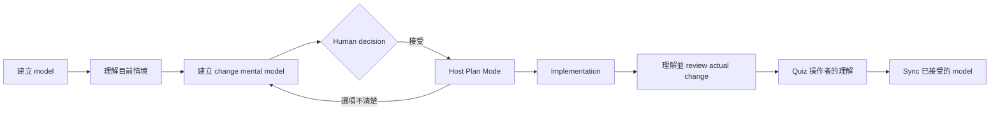

# mental

`mental` 是一套住在 Claude Code 與 Codex 裡的 Agent-native skills。它把使用者指定的 repo、文件、文字或網址整理成可驗證、可版本化的 mental model，並透過 agent 協助理解、學習、練習、測驗與修正模型。

它不是另一個獨立 CLI，也沒有後端、帳號、遙測、MCP 或外部 LLM API。使用者面對的是九個 `/mental:*`／`$mental:*` skills；Python 腳本只供 skills 內部進行確定性的建檔與檢查。

[English README](README.md)

設計文件：[設計背景與研究架構](docs/design-background.zh-TW.md) · [STE100 評估與寫作規範](docs/ste100-evaluation.zh-TW.md)

## Quickstart

### 1. 載入 `mental`

Claude Code 開發環境最快的試用方式：

```sh
git clone https://github.com/issac1441/mental.git
cd /path/to/你想理解的-repo
claude --plugin-dir /absolute/path/to/mental
```

Codex 必須先依照[安裝與測試](#安裝與測試)的說明，從已設定的 plugin marketplace 安裝 `mental`，再開啟目標 repo：

```sh
codex -C /path/to/你想理解的-repo
```

### 2. 建立 draft model

```text
/mental:build 為目前 workspace 建立 repo mental model。
$mental:build 為目前 workspace 建立 repo mental model。
```

`build` 會建立 draft artifacts 並顯示 promotion gate。請檢查邊界、關係、agent 推論、成功與失敗情境、衝突和已知缺口；只 promotion 你接受的 artifacts。

### 3. 自動選擇或手動指定回答情境

```text
/mental:understand 一個 request 如何走過這個 repo？
/mental:understand 說明 retry 決策。lens=pm views=anchor,scenario detail=brief
```

`understand` 會依序參考手動參數、目前明確目標、session history、個人學習狀態、host 有提供時的弱 memory signal，以及 scope default。回答會揭露選到的 Lens、Views、Detail 與簡短理由；除非你明確要求，否則不會保存推論出的偏好。

可用參數：

- `lens=general|engineer|architect|pm|operator|student|researcher|<custom-lens-id>`
- `views=anchor,map,mechanism,scenario,evidence`，可複選
- `detail=brief|standard|deep`

專案也能在 `mental/lenses/` 建立共享的自訂 Lens artifact。

每個 skill 內的 Input contract 才是 canonical 參數定義。Host 介面可能顯示 skill description 或 default prompt，但 Claude Code 與 Codex 不保證都有列舉型參數 autocomplete。

### 4. 決定、實作並理解變更

```text
/mental:change 加入 request timeout，但不要改變 failure semantics。
/mental:change 告訴我目前 plan 中 option A 的實際影響。
/mental:review 依照已接受的 model review 目前 diff。
/mental:quiz current-change items=12 feedback=end format=mixed
```

Codex 請改用 `$mental:*`。`change` 預設是對話式唯讀分析，只有你要求記錄時才建立 draft brief，而且一定停在 human decision。`review` 會先說清楚實際改了什麼，再進行正確性審查。

### 5. 從指定材料學習

```text
/mental:build 從 docs/protocol.md 建立 learning model。
/mental:learn 我想要能解釋並 debug 這個 protocol。
/mental:practice 幫我修正這個 model 裡最弱的關係。
/mental:quiz docs/protocol.md items=12 format=open
```

共享材料放在 `mental/`；個人目標、答案、進度與 session 紀錄放在 gitignored `.mental/`。

## 核心方法

`mental` 使用 **Lens × Views × Detail**：

- **Lens** 合併 audience 與 perspective，代表「哪個角色通常具備的知識、語彙、關注與決策方式」應該塑造這次回答，例如 `engineer`、`architect`、`pm` 或 `student`。
- **Views** 是可以複選的語意切面：`anchor`、`map`、`mechanism`、`scenario`、`evidence`。
- **Detail** 控制每個 View 的密度：`brief`、`standard`、`deep`。

Lens 是這個 session 的回答策略，不是永久身份或能力判定。手動指定永遠優先。Repo 情境預設使用 `engineer`；一般學習情境預設使用 `student`。

其餘治理規則是：

- 分開 `[observed]`、`[inferred]`、`[agreed]` 與 `[conflict]` 主張；
- 先建立 draft，再由人類決定是否成為 canonical；
- 來源、程式碼、測試與 runtime evidence 是材料／實作真相，canonical artifacts 是人類同意的概念真相；
- 兩者衝突時不得靜默改寫；
- 共享模型放在 `mental/`，個人狀態放在 `.mental/`。

## Skills

| Skill | 用途 | 預設寫入 |
| --- | --- | --- |
| `understand` | 依 session 自動選擇或手動指定 Lens、Views、Detail 來解釋 | 無 |
| `build` | 從指定來源建立 draft model 與共享自訂 Lens | 僅 draft |
| `sync` | 提出 source-to-model delta | 僅 draft delta |
| `doctor` | 檢查結構、Lens、證據、drift 與 privacy | 無 |
| `change` | 在實作前解釋 intent、選項、plan 或 TODO | 無；要求記錄才寫 draft brief |
| `review` | 先解釋 actual change，再依 agreed model 審查 | 無 |
| `learn` | 用 2–5 題診斷缺口，再自適應教學 | 有學習證據後才寫 private state |
| `practice` | 一次一題，自適應修正一個薄弱關係 | 有學習證據後才寫 private state |
| `quiz` | 一次交付完整 10–20 題有界測驗 | 無；要求時才保存 private result |

### Practice 和 quiz 的差異

需要讓下一題跟著上一題答案改變時，使用 `practice`：題目 → 第一個斷裂關係 → 最小修正 → 結構相同但情境不同的新題 → 遷移 → 邊界。需要一份完整考卷時，使用 `quiz`。Quiz 預設 12 題 mixed、全部作答後再 feedback；可以給 `9/12` 這種客觀分數，但不會把它轉成虛假的 mastery 百分比或全局能力標籤。

## 什麼情境該用哪個 skill

| 情境 | Skill |
| --- | --- |
| 剛進入陌生 repo | `build` |
| 目前說明或 session 已經看不懂 | `understand` |
| Plan 出現 A/B 選項 | `change` |
| 很長的 TODO list 藏著決策與影響 | `change` |
| Agent 已經實作完 diff | `review` |
| 想確認自己是否理解這次變更 | `quiz current-change` |
| 開始一個由指定來源限定的新主題 | `build`，再 `learn` |
| 某個概念或關係仍然薄弱 | `practice` |
| 來源或 code 已偏離 canonical model | `sync` |
| Artifact、自訂 Lens 或隱私邊界可能有問題 | `doctor` |

## 代表性流程

**Vibe coding：**`build → understand → change → human decision → Plan Mode → implementation → review → quiz → sync`

**產品決策：**`understand lens=pm → change compare A/B → human decision → Plan Mode → review`

**學習：**`build 指定來源 → learn → practice → quiz`



`change` 通常在 Plan Mode 前：它定義「系統應該變成什麼」並揭露 trade-off；Plan Mode 再定義「如何實作已接受的決定」。如果已經有 plan 或 TODO，`change` 也能反向解讀；決策改變後再回 Plan Mode 更新步驟。

## Artifact 結構

```text
mental/
├── index.md
├── sources.md
├── glossary.md
├── lenses/          # 共享角色 Lens，按需
├── model/map.md
├── concepts/
├── scenarios/
├── contracts/       # repo mode，按需
├── decisions/       # repo mode，按需
├── changes/         # 有要求記錄的 delta，按需
├── learning/path.md # learning mode，按需
├── misconceptions/
└── exercises/

.mental/
├── .gitignore
├── profile.md
├── mastery.json
└── sessions/
```

每個共享 Markdown artifact 都有穩定英文 frontmatter key 與 ID。詳見 [artifact contract](references/artifact-contract.md)。

## 安裝與測試

### Claude Code

```sh
claude --plugin-dir /absolute/path/to/mental
claude plugin validate /absolute/path/to/mental
```

本 repo 已內建 marketplace manifest（`.claude-plugin/marketplace.json`），正式安裝不需要額外的 marketplace repo：

```sh
claude plugin marketplace add issac1441/mental
claude plugin install mental@mental
```

本機 checkout 同理：`claude plugin marketplace add /absolute/path/to/mental`。

### Codex

從已設定的 plugin marketplace 安裝 `mental`，接著用 `/skills` 或 `$` 選擇 skills。本 repo 自帶 marketplace manifest，checkout 可直接註冊：

```sh
codex plugin marketplace add /absolute/path/to/mental
codex plugin add mental@mental
```

套件使用 `.codex-plugin/plugin.json` 與 `skills/*/SKILL.md`；Claude 與 Codex 共用相同技能語意。

### OpenCode 相容模式

V1 僅提供文件層級相容，不承諾 native namespace parity。將 `skills/`、`references/`、`scripts/`、`assets/` 一起複製或連結至同一個 `.agents/` 目錄並保留相對路徑；OpenCode 會以 `understand`、`build` 等未加 namespace 的名稱發現它們。

## 開發驗證

解釋品質由 [`evals/`](evals/README.md) 的 learning-transfer eval 度量：讓一個看不到程式碼的讀者只憑說明文件作答 probe 題，並與裸模型基準線比較。

本專案沒有 runtime dependencies：

```sh
python3 -m unittest discover -s tests -v
python3 scripts/scaffold_workspace.py /tmp/mental-demo --mode hybrid --language zh-TW
python3 scripts/validate_workspace.py /tmp/mental-demo
```

這些 Python helpers 是 skill 內部實作細節，不是公開 CLI。

## 授權

[0BSD](LICENSE)。可以自由使用、複製、修改與散布；重新散布時不要求署名，也不要求保留著作權聲明。
