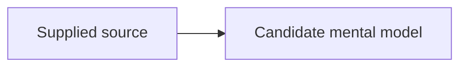

# Model map

## Boundary

Describe the evidence-derived scope currently represented. Put interpretive boundaries in `Inferences and gaps`.

## Relationships

## Representative scenario

Add the smallest source-backed scenario that tests whether the relationship map predicts an outcome.

## Counterexample or failure

Add one source-backed boundary case that prevents overgeneralization.

## Evidence

- `{{SOURCE_ID}}`: inspection pending

## Inferences and gaps

- Source inspection is incomplete.
- Link any open `mental/conflicts/` artifacts here.
