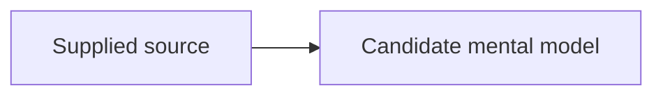

# Model map

## Boundary

[inferred] Describe what is inside and outside the model.

## Relationships

## Representative scenario

[inferred] Add the smallest scenario that tests whether the relationship map predicts an outcome.

## Counterexample or failure

[inferred] Add one boundary case that prevents overgeneralization.

## Evidence

- `{{SOURCE_ID}}`: inspection pending
